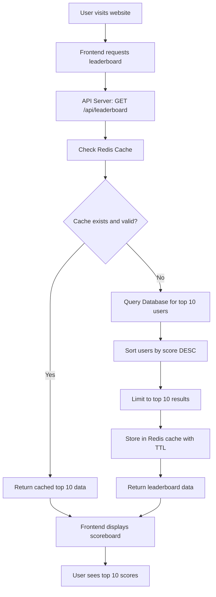
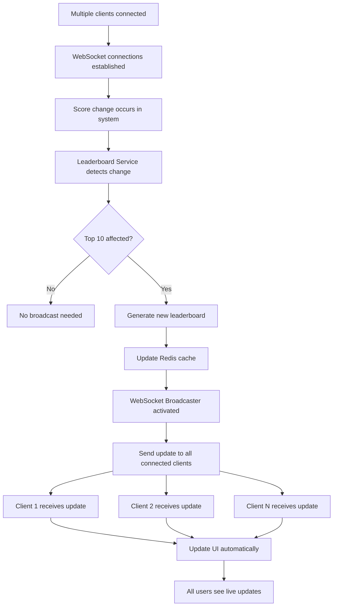
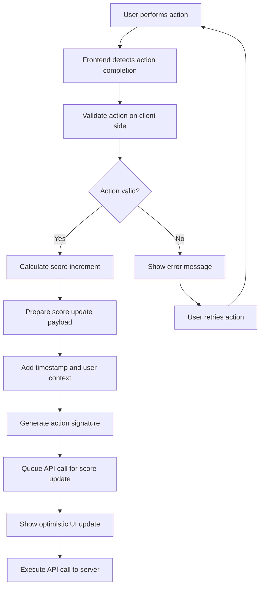
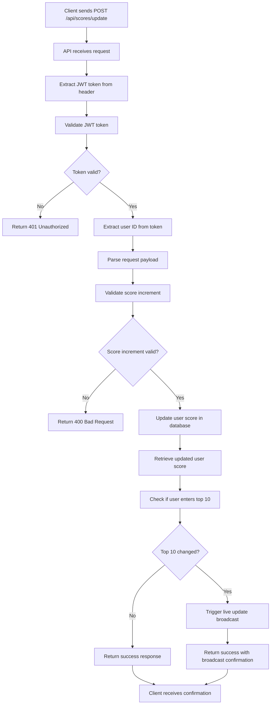
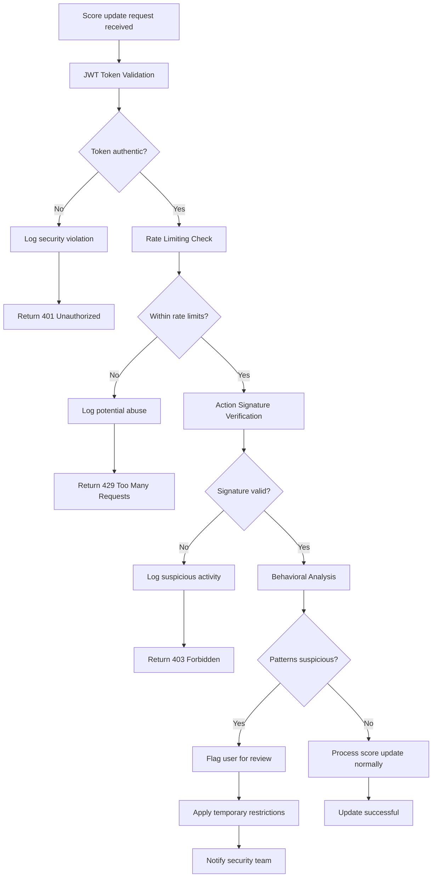

# Scoreboard API Module - Complete Specification

## Overview

The Scoreboard API module provides real-time score management and leaderboard functionality for web applications. This specification addresses 5 core requirements with individual flowcharts for each component.

## Table of Contents

1. [Requirement 1: Top 10 Scoreboard Display](#requirement-1-top-10-scoreboard-display)
2. [Requirement 2: Live Update System](#requirement-2-live-update-system)
3. [Requirement 3: User Action Score Increase](#requirement-3-user-action-score-increase)
4. [Requirement 4: API Score Update](#requirement-4-api-score-update)
5. [Requirement 5: Anti-Cheat Security](#requirement-5-anti-cheat-security)

---

## Requirement 1: Top 10 Scoreboard Display

### Description
Display a leaderboard showing the top 10 users with highest scores on the website.

### Flowchart 1: Scoreboard Display

### Implementation Details
- **Cache Strategy**: Redis with 30-second TTL
- **Database Query**: `SELECT * FROM users ORDER BY total_score DESC LIMIT 10`
- **Response Format**: JSON with rank, username, score
- **Refresh**: Auto-refresh every 30 seconds or on user action

---

## Requirement 2: Live Update System

### Description
Implement real-time updates to the scoreboard without requiring page refresh.

### Flowchart 2: Live Update Broadcasting

### Implementation Details
- **Protocol**: WebSocket for real-time communication
- **Broadcasting**: Server-sent events to all connected clients
- **Update Trigger**: Only when top 10 changes
- **Connection Management**: Auto-reconnect on disconnect

---

## Requirement 3: User Action Score Increase

### Description
When a user completes an action, their score should increase according to predefined rules.

### Flowchart 3: User Action Processing

### Implementation Details
- **Action Types**: Different actions have different score values
- **Client Validation**: Basic validation before server call
- **Optimistic Updates**: Show score increase immediately
- **Rollback**: Revert if server rejects update

---

## Requirement 4: API Score Update

### Description
API endpoint to receive and process score update requests from client applications.

### Flowchart 4: API Score Update Processing

### Implementation Details
- **Endpoint**: `POST /api/scores/update`
- **Authentication**: JWT token required
- **Validation**: Score increment limits per action type
- **Response**: Updated score and leaderboard position

---

## Requirement 5: Anti-Cheat Security

### Description
Prevent malicious users from artificially increasing scores without proper authorization.

### Flowchart 5: Security Validation System

### Implementation Details
- **JWT Validation**: Verify token signature and expiration
- **Rate Limiting**: Maximum 10 updates per minute per user
- **Action Signatures**: HMAC verification for critical actions
- **Behavioral Analysis**: Monitor patterns for bot-like behavior
- **Logging**: Comprehensive security event logging

---
